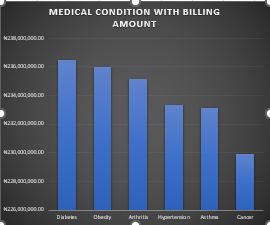
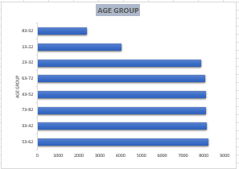
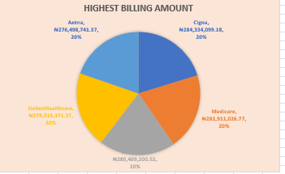
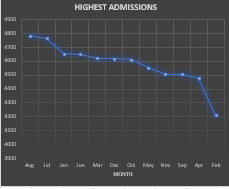
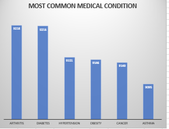
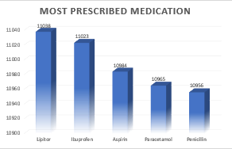
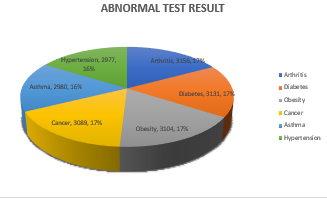

# IOTB_TECH_Hospital_Analysis

## Introduction 
---
**IOTB Tech Hospital Analysis** using Microsoft Excel, Pivot Tables, and Pivot Charts to analyze hospital data. The analysis helps identify trends in patient admissions, abnormal test results, age distribution, insurance contributions, and common medical conditions. Pivot Tables summarize large datasets, while Pivot Charts provide visual insights for easier interpretation. This analysis supports better decision-making, improves hospital management, and enhances healthcare service delivery.

---
## Questions to answer
1. Which condition generates the highest revenue?
2. Which age group visits the hospital most?
3. Which insurance provider contributes the most financially?
4. Which admission type is most common?
5. Which condition keeps patients in the hospital the longest?
6. What is the most prescribed medication?
7. Which condition give the most abnormal test result?
8. What is the most common medication condition?
9. Which month generate the highest revenue?
---
## Q1 
Which condition generates the highest revenue?

## INSIGHT
From the trend above the medical condition with the highest revenue is **Diabetes**
it is a major revenue driver because it requires ongoing treatemnt,medications,and regular patirnt visits

**Observation**
diabetes may contribute more financially because they often require long-term treatment, tests, and medication

**Recommendations**
Improve patient care quality to maintain trust and increase treatment efficiency.

**Bussiness Suggestion**
Develop medical laboratory and diagnostic services focused on diabetes disease management.

---
## Q2
Which age group visits the hospital most?

## INSIGHT
Middles aged and elderly individuals dominate the dataset, indicating that heealthcare demand higher among older populations due to increased vulnerability to some different diseases,regular check up,and age related health compluications

---
## Q3
Which insurance provider contributes the most financially?

## INSIGHT
Billing amounts are almost equally distributed among the five insurance providers with eacg contributing approximately 20% to the total billing revenue . Cigna recorded the highest billing amount at #284,334,080 slightly outperforming others.

---
# Q4
Which admission type is most common?

## INSIGHT
Admissions peak at approximately 4,800 (led by August and July) before stabilizing into an extended plateau between 4,600 and 4,650 admissions across the majority of the tracked months. Volume ultimately bottoms out in February at 4,200 admissions, representing a significant 12.5% drop from the peak.

---
## Q5
Which condition keeps patients in the hospital the longest?

## INSIGHT
The chart presents a breakdown ranking six medical conditions by case volume. Visually, the chart implies a sharp step-down in prevalence from left to right, specifically showing Asthma as a minor fraction of Arthritis. However, a look at the data labels reveals that all six conditions have an incredibly uniform distribution, with less than a 1.5% variance between the highest and lowest volumes.
Top Conditions: Arthritis (9,218 cases) and Diabetes (9,216 cases) are virtually identical, serving as the leading diagnoses in this dataset.

---
## Q6
What is the most prescribed medication?

The chart tracks the volume of the top five prescribed medications, arranged in descending order. While the 3D bars visually suggest a steep decline in popularity from Lipitor down to Penicillin, the underlying data labels reveal that prescription volume across all five medications is incredibly uniform, with less than a 1% variance between the top and bottom ranks.Lipitor sits at the top with 11,038 prescriptions

---
## Q7
 Which condition give the most abnormal test result?

 

 The chart details the breakdown of abnormal test results categorized by six underlying medical conditions, the distribution across all categories is almost completely uniform. Every single condition accounts for either 16% or 17% of the total abnormal results, indicating no single condition is driving a disproportionate volume of diagnostic anomalies. But Arthritis has 3,156 abnormal results whcih made it the condition with the highest abnormal result.

 ---
 ## Q8
What is the most common medication condition?

 
